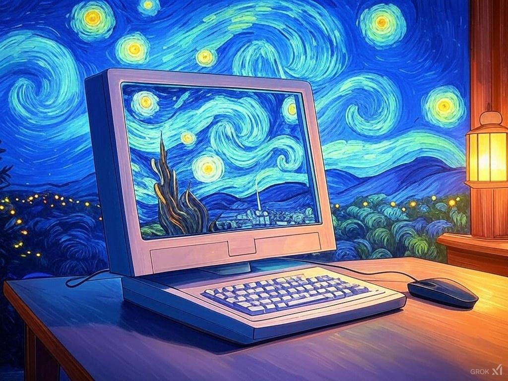

# 17-Day Challenge: Everyday a Website

## Overview
The **17-Day Challenge** is a personal project to create one website every day for 17 consecutive days. Each project is a unique concept, showcasing creativity, technical skills, and problem-solving in web development. This journey began on **21.12.24** and ends on **06.01.25**, during my winter holidays. ❤️

### Challenge Goal:
Build 17 websites in 17 days to sharpen skills, explore new ideas, and have fun while creating.  
All projects are or will be **open-source**, so feel free to contribute, modify, or use them as you like!

---

## Progress

### ✅ Completed Projects:
1. **Day 1 - DREAM**  
   A website where users can write down and reflect on the dreams they had during the night.

2. **Day 2 - Advanced Voice**  
   A local, voice-controlled interface inspired by OpenAI's Advanced Voice Mode.

3. **Day 3 - Prompt Improver**  
   An AI-powered tool designed to enhance user-provided prompts for better outcomes.

4. **Day 4 - Relax**  
   A minimalistic website that displays quotes and aesthetic images to help users unwind.

5. **Day 5 - easy favicon**  
   A simple, intuitive tool for generating custom favicons effortlessly.

6. **Day 6 - Origami**  
   Step-by-step instructions for creating paper origami.

7. **Day 7 - Easy PNG**  
   A drag-and-drop website that converts any image type—even SVGs—into PNG format.

8. **Day 8 - The Noise**  
   A website offering a variety of sounds, from white noise to brown and even grey noise.

9. **Day 9 - Easy Files**  
   Similar to Easy PNG, but with added functionality to convert WAV files to MP3.

10. **Day 10 - Dr. Tanzbär**  
    A fun website created as a joke for a friend aspiring to start a makeup brand. This is one of my personal favorites!

11. **Day 11 - Germanize**  
    A translator tool focused on word-for-word German translations—intentionally awkward and messy for humorous effect.

12. **Day 12 - PlantMatch**  
    A website to help users find plants that match their personality and lifestyle.

13. **Day 13 - The Daily Reel**  
    Inspired by en.app, this website helps users discover movies based on their preferences, presented in a newspaper-style layout.  
    [Visit The Daily Reel](https://the-daily-reel.vercel.app/)

---

## Connect
Interested in any of these projects? Let’s collaborate or chat!  
**Email:** [bergernikita1807@gmail.com]
